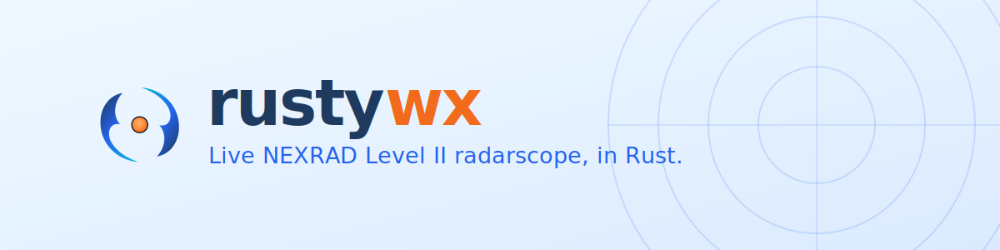
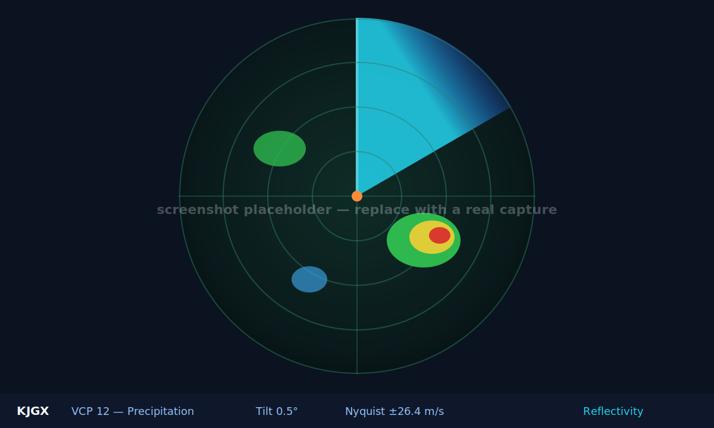

<p align="center">
  <picture>
    <source media="(prefers-color-scheme: dark)" srcset="assets/header-dark.svg">
    
  </picture>
</p>

<p align="center">
  <a href="https://github.com/kerryhatcher/rustywx/actions/workflows/ci.yml"></a>
  <a href="https://crates.io/crates/rustywx"></a>
  <a href="LICENSE"></a>
  
  <a href="https://github.com/kerryhatcher/rustywx/releases"></a>
</p>

**rustywx** is a desktop radarscope that streams live NEXRAD Level II Doppler
data straight from NOAA's public AWS archive, decodes it, and paints a classic
PPI weather scope — reflectivity, velocity, and spectrum width — with live NWS
warning polygons and National Hurricane Center overlays.

<p align="center">
  
</p>

> [!NOTE]
> The image above is a placeholder mock. Drop a real capture at
> `assets/screenshot.png` and swap the `src` above — a demo GIF is the single
> highest-value thing this README is still missing.

## ✨ Features

- **📡 Live Level II data** — pulls the newest volume scans from the public
  `unidata-nexrad-level2` S3 bucket. No AWS account, no API key.
- **🎨 Three products** — Reflectivity, Velocity, and Spectrum Width, on
  NWS-style color tables.
- **🎚️ Tilt selector** — step through elevation angles with live VCP and
  Nyquist-velocity readout.
- **⚠️ NWS alerts** — tornado / severe-thunderstorm warning and watch polygons
  overlaid in real time.
- **🌀 Tropical overlays** — National Hurricane Center storm tracks and
  forecast cones.
- **🗺️ Geographic context** — range rings, cardinal spokes, city markers, and
  state / county borders.
- **🧹 TDBZ clutter filter** — knock out wind-turbine and ground clutter, with
  adjustable sensitivity.
- **⏱️ Auto-refresh** — configurable poll interval (default 2 min) with smooth
  animation between volumes.
- **⌨️ Keyboard-driven** — full shortcut overlay (press <kbd>?</kbd>).

## 🚀 Quick Start

```bash
cargo install rustywx
rustywx
```

That's it — no credentials, no config. rustywx opens on **KJGX (Robins AFB,
Macon GA)** and starts pulling live scans. You need a Rust toolchain
([rustup](https://rustup.rs)) and network access.

Prefer not to build? Grab a prebuilt binary from the
[Releases](https://github.com/kerryhatcher/rustywx/releases) page.

## 📑 Table of Contents

- [Features](#-features)
- [Quick Start](#-quick-start)
- [Why rustywx](#-why-rustywx)
- [Installation](#-installation)
- [Usage](#-usage)
- [Products & Controls](#-products--controls)
- [Architecture](#-architecture)
- [Contributing](#-contributing)
- [License](#-license)
- [Acknowledgements](#-acknowledgements)

## 🤔 Why rustywx

Weather-radar viewers tend to be either heavyweight desktop suites or
browser tabs at the mercy of a vendor's tile server. rustywx is a small,
fast, native alternative: it talks directly to the same public Level II
archive the pros use, decodes the raw Doppler volumes locally, and renders
them on the GPU with the [ply-engine](https://github.com/kerryhatcher/rustywx)
graphics framework. Point it at a NEXRAD site and you have a self-contained
radarscope — no subscriptions, no telemetry, no middleman.

## 📦 Installation

### From crates.io (recommended)

Requires a stable Rust toolchain (edition 2024, **Rust 1.85+**).

```bash
cargo install rustywx
rustywx
```

<details>
<summary>Prebuilt release binaries</summary>

Prebuilt binaries for Linux (x86-64 / ARM64), macOS (Apple Silicon), and
Windows (x86-64) are attached to each
[GitHub Release](https://github.com/kerryhatcher/rustywx/releases). Download,
unpack, and run.

</details>

<details>
<summary>From source (for development)</summary>

```bash
git clone https://github.com/kerryhatcher/rustywx
cd rustywx
just run          # or: cd app && cargo run --release
```

`just run` launches from the `app/` directory so runtime assets resolve
correctly during development. See [`CONTRIBUTING.md`](CONTRIBUTING.md).

</details>

<details>
<summary>Platform notes</summary>

| Platform | Notes |
|----------|-------|
| **macOS** | Apple Silicon builds are published; Intel builds from source. |
| **Linux** | Needs a GPU/Vulkan-capable environment and standard build tooling (`build-essential`, `pkg-config`). |
| **Windows** | x86-64 build published. |

The app renders on the GPU via ply-engine, so a working graphics stack is
required — headless servers won't display a window.

</details>

## 🛠️ Usage

```bash
rustywx                                     # launch the scope
```

Developing on rustywx? Run the tests from the repo:

```bash
cargo test                                  # unit tests, no network
cargo test --test network -- --ignored      # live end-to-end fetch/decode
```

On launch, rustywx opens on your default site and begins polling. Switch
products, change tilt, and toggle overlays from the toolbar or the keyboard.
Open the ⚙️ settings panel to change the default site, poll interval, overlay
defaults, animation level, and clutter-filter sensitivity — settings persist
across restarts.

See the **[User Guide](USER_GUIDE.md)** for a full walkthrough of the display,
how to read each product, and every setting.

## 🎛️ Products & Controls

| Product | Shows | Reading it |
|---------|-------|------------|
| **Reflectivity** | Precipitation intensity | Red/magenta = heavy rain or hail; green/blue = light. |
| **Velocity** | Radial motion | Green = toward radar (inbound); red = away (outbound). |
| **Spectrum Width** | Velocity dispersion | High values flag turbulence, shear, and rotation. |

Press <kbd>?</kbd> in-app for the full keyboard-shortcut overlay (product
selection, tilt control, overlay toggles, settings, quit).

## 🏗️ Architecture

The app is the `rustywx` crate under [`app/`](app/), on the ply-engine backend:

| Module | Responsibility |
|--------|----------------|
| `main.rs` | App entry, async game loop, frame drawing |
| `state.rs` | App state — selected site, overlays, animation |
| `data.rs` | Background worker: poll S3 → download → decode → channel |
| `model.rs` | Thin scan model (product → sweeps → radials → gates) |
| `scope.rs` | PPI rasterizer and overlay painting |
| `colors.rs` | NWS-style color tables |
| `geo.rs` | Range/bearing and polar → screen projection |
| `cities.rs`, `borders.rs` | Scope overlays — city markers, state boundaries |
| `alerts.rs`, `nhc.rs` | NWS alerts and NHC tropical overlays |
| `cache.rs`, `rle.rs` | Ply-storage scan cache + RLE compression |
| `widgets/` | Reusable glass-panel UI widgets |

Design docs live in [`docs/`](docs/). For build/test/lint commands and how to
extend the app, see [`CONTRIBUTING.md`](CONTRIBUTING.md).

## 🤝 Contributing

Contributions are welcome. See **[CONTRIBUTING.md](CONTRIBUTING.md)** for dev
setup, the module map, and the build/test/lint workflow, and please read our
[Code of Conduct](CODE_OF_CONDUCT.md). Security issues? See
[SECURITY.md](SECURITY.md).

## 💬 Support

- **Bugs & feature requests:** [open an issue](https://github.com/kerryhatcher/rustywx/issues)
- **Questions & ideas:** [GitHub Discussions](https://github.com/kerryhatcher/rustywx/discussions)
- **Changelog:** see [CHANGELOG.md](CHANGELOG.md) or the
  [Releases](https://github.com/kerryhatcher/rustywx/releases) page

## 📄 License

- **Code:** [AGPL-3.0-only](LICENSE)
- **Custom graphics, artwork, and assets:**
  [CC BY-SA 4.0](https://creativecommons.org/licenses/by-sa/4.0/legalcode.en)

## 🙏 Acknowledgements

- **[NOAA](https://www.noaa.gov/) / Unidata** for the public
  `unidata-nexrad-level2` Level II archive on AWS.
- **[NWS](https://www.weather.gov/)** for the alerts feed and
  **[NHC](https://www.nhc.noaa.gov/)** for tropical-cyclone products.
- The Rust NEXRAD decoding crates that make the raw volumes readable.
- Built with the **ply-engine** graphics framework.
